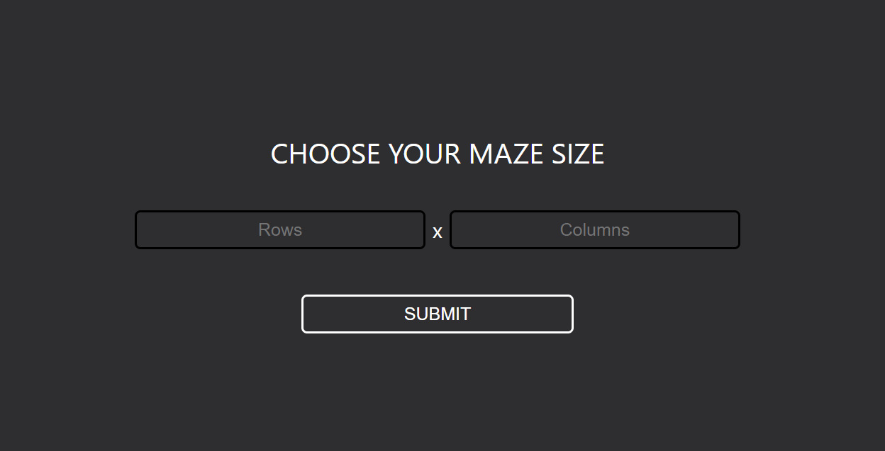
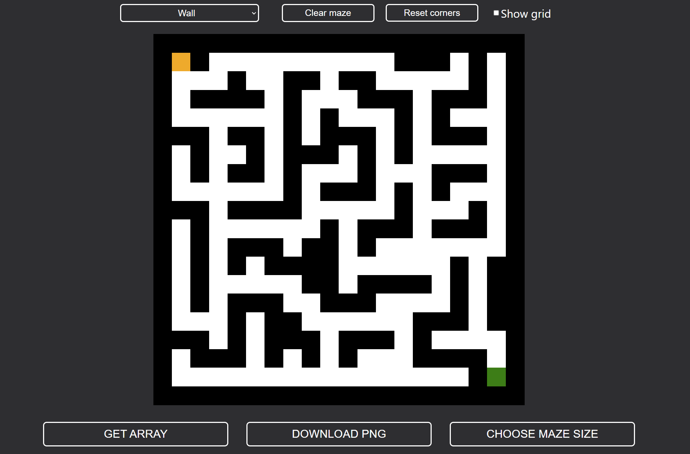

# Maze creator
> App for creating your own mazes 

## Table of contents

- [Introduction](#introduction)
- [Technologies](#technologies)
- [Installation](#installation)
- [Usage](#usage)

## Introduction
This simple program allows you to create your own maze by "drawing" walls or paths on a canvas.
You can print your maze in the form of an array to use it for your own projects. This program also allows you to download
your maze as a PNG image.

## Technologies

- ReactJS - v18.1.0
- Formik - v2.2.9
- SVG.js - v3.1.2

## Installation

Clone this repository and go to the project directory. You will need `node` and `npm` or `yarn` for this program to work.

Install the dependencies:

`npm install` or `yarn install`

To start the program:

`npm start` or `yarn start`

The application will be under `localhost:3000`.

## Usage

Choose you maze size

Start "drawing" on the canvas.

You can choose whether you want to draw a wall, path, start or finish by changing the option in the top left corner.
The program has also some basic features like clearing the maze or filling the maze corners.
You can also turn the grid on the canvas on and off.

The `Get array` button will print your maze in the form of an array which you can use for your own projects.

The `Download PNG` button will download your maze as a PNG image.